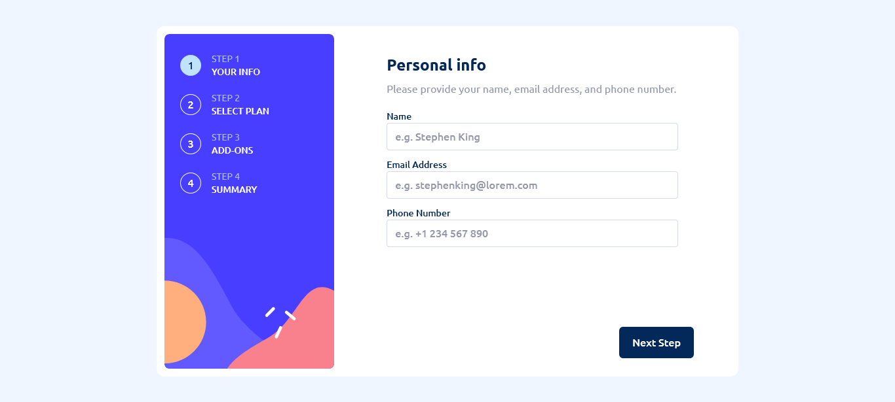
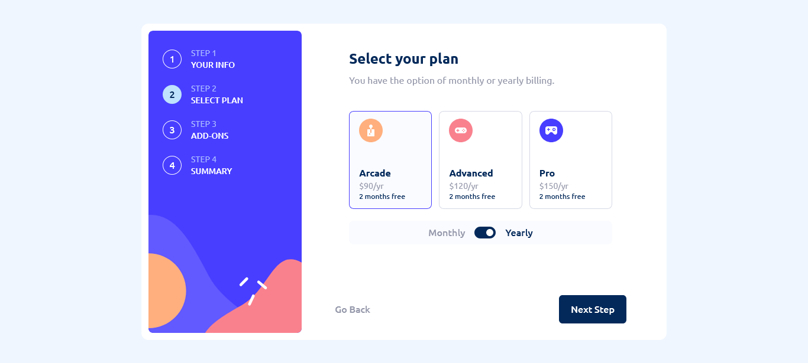
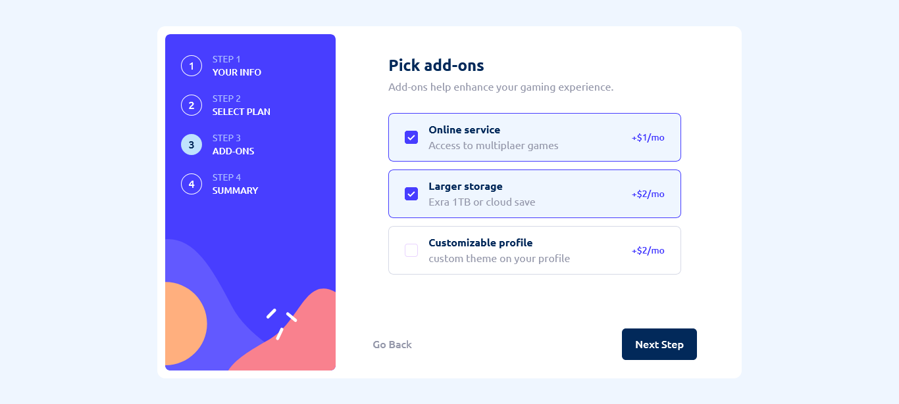
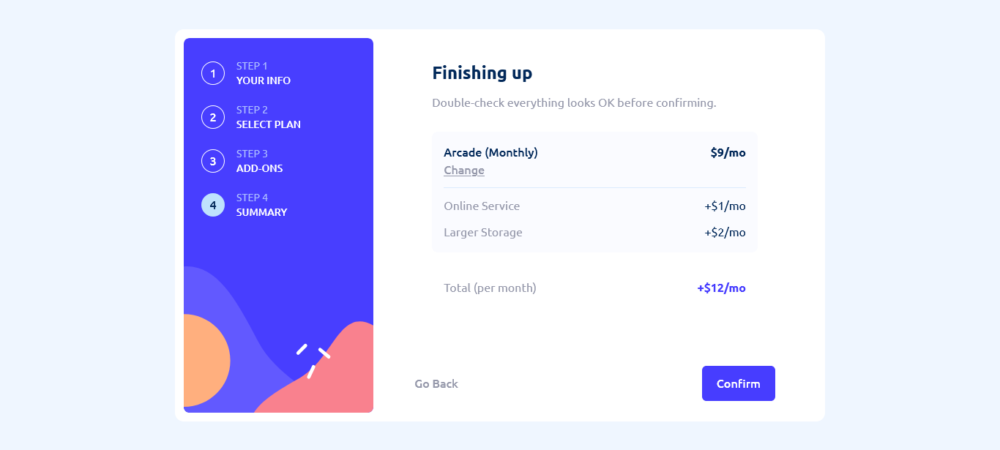
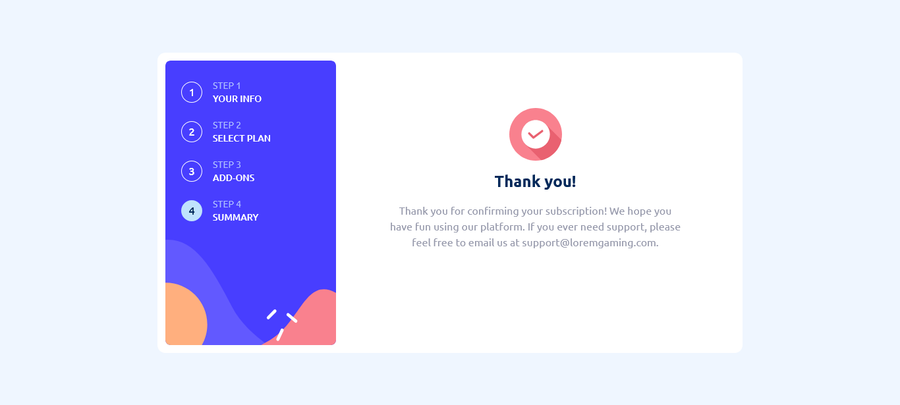

# Multi-step form

This is a solution to the [Multi-step form challenge on Frontend Mentor](https://www.frontendmentor.io/challenges/multistep-form-YVAnSdqQBJ). Frontend Mentor challenges help you improve your coding skills by building realistic projects. 

## Table of contents

- [Overview](#overview)
  - [The challenge](#the-challenge)
  - [Screenshot](#screenshot)
  - [Links](#links)
- [My process](#my-process)
  - [Built with](#built-with)
  - [What I learned](#what-i-learned)

## Overview

### The challenge

Users should be able to:

- Complete each step of the sequence
- Go back to a previous step to update their selections
- See a summary of their selections on the final step and confirm their order
- View the optimal layout for the interface depending on their device's screen size
- See hover and focus states for all interactive elements on the page
- Receive form validation messages if:
  - A field has been missed
  - The email address is not formatted correctly
  - A step is submitted, but no selection has been made

### Screenshot

### Links

- Solution URL: [solution URL](https://github.com/cassiopeia001/multi-step-form)
- Live Site URL: [live site URL](https://cassiopeia001.github.io/multi-step-form/)

## My process

### Built with

- Semantic HTML5 markup
- CSS custom properties
- Flexbox
- Mobile-first workflow
- Accessibility
- Responsive design best practises
- [React](https://reactjs.org/) - JS library
- [Tailwind](https://tailwindcss.com/) - CSS framework

### What I learned

This project was a great learning experience that challenged me in several ways. Building a multi-step form allowed me to work with React’s useReducer hook, which proved to be an efficient tool for managing complex state logic. I also leveraged the Context API to pass data through deeply nested components, effectively avoiding prop drilling. Ensuring accessibility presented a technical challenge, but it helped me write cleaner, more inclusive code and strengthened my understanding of accessibility guidlines and best practises. Additionally, I learned to use Framer Motion to implement smooth, visually appealing animations throughout the form. 

